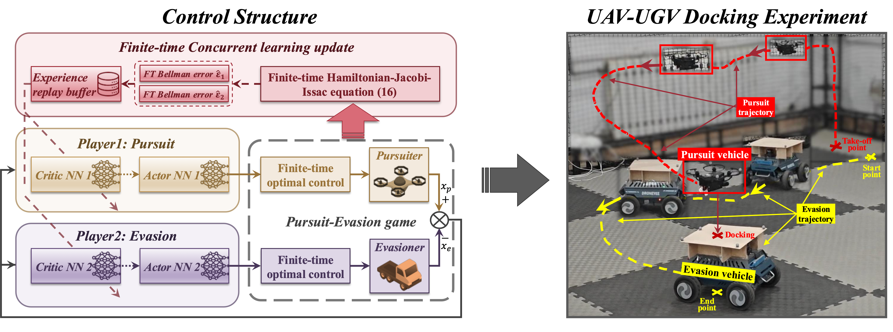

# FT-RL-PEG-sim1
 
This repository contains the code for the paper ["Unmanned Aerial-Ground Vehicle Finite-Time Docking Control via Pursuit-Evasion Games"](https://link.springer.com/article/10.1007/s11071-025-11021-6) published in the *Nonlinear Dynamics* Journal (March 2025). The simulation demonstrates finite-time docking control for a nonlinear pursuit-evasion system between aerial and ground vehicles.

+ Details of the paper can be found at: [Junkai Tan's Publications](https://tanjunkai2001.github.io/publications/)
+ Download the paper at: [Download pdf](https://tanjunkai2001.github.io/assets/Unmanned%20aerial-ground%20vehicle%20finite-time%20docking%20control%20via%20pursuit-evasion%20games.pdf)

## Citation

If you use this code or find our research helpful, please cite our paper:

```bibtex
@article{Tan2025,
    author = {Tan, Junkai and Xue, Shuangsi and Guan, Qingshu and Niu, Tiansen and Cao, Hui and Chen, Badong},
    title = {Unmanned aerial-ground vehicle finite-time docking control via pursuit-evasion games},
    journal = {Nonlinear Dynamics},
    year = {2025},
    month = {March},
    doi = {10.1007/s11071-025-11021-6},
    url = {https://doi.org/10.1007/s11071-025-11021-6}
}
```

## Overview

Simulation: Finite-time docking control of a nonlinear pursuit-evasion system


Files:
- `Simulation/main_FT_PEG_Tracking_exp1.m`: Main file to run the simulation
- `Simulation/Plotting_main_FT_PEG_Tracking_exp1.m`: Main file to plot the results
- `Data/data_FT_PEG_Tracking.mat`: Data file containing the results of the simulation